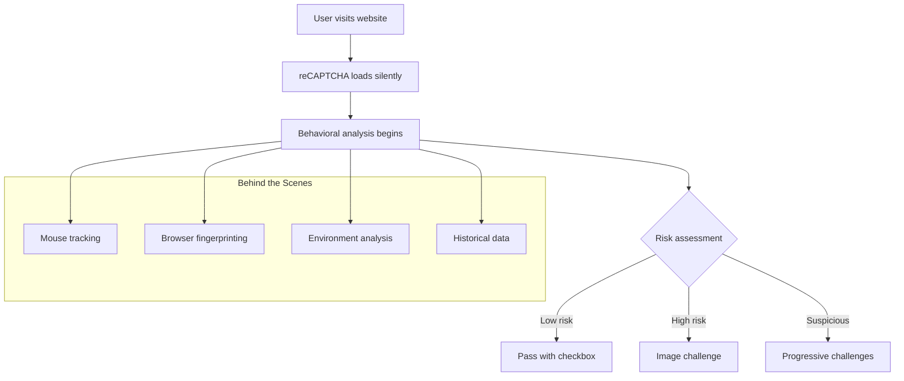
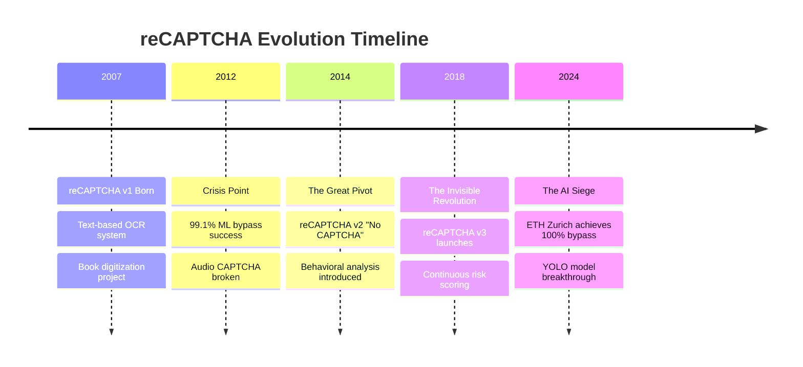
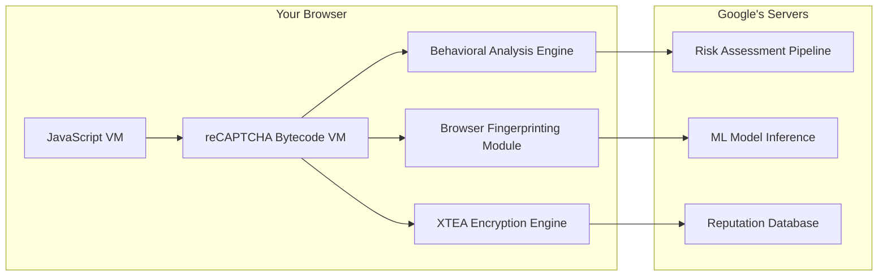
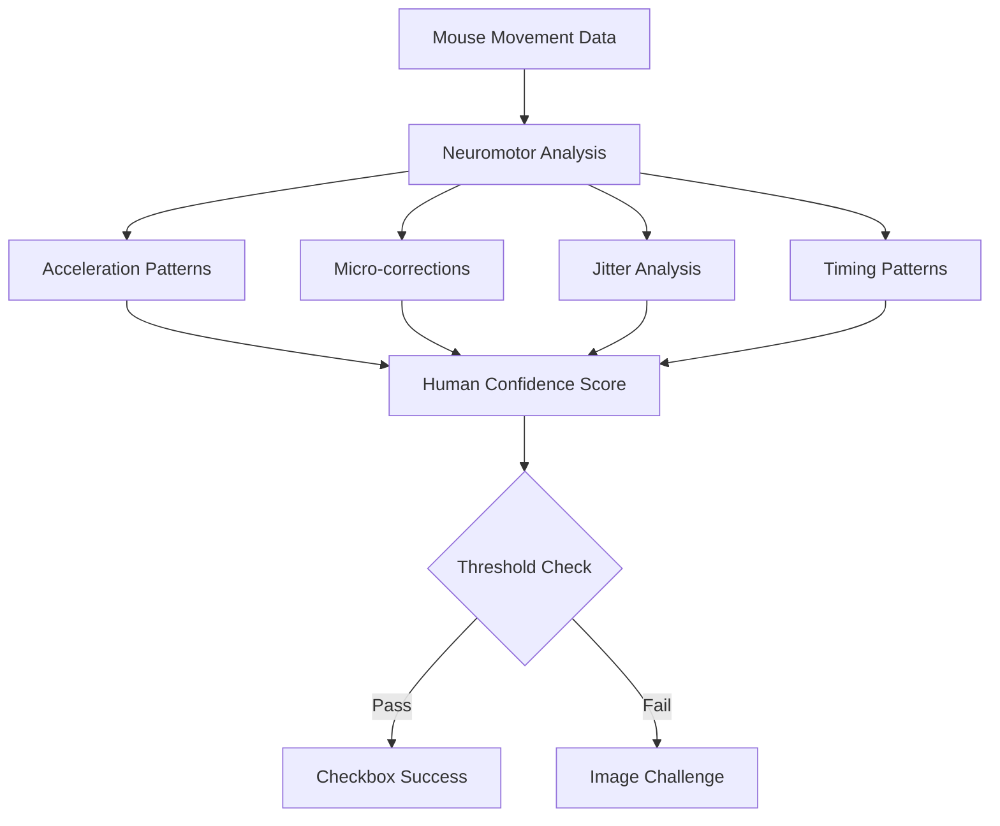
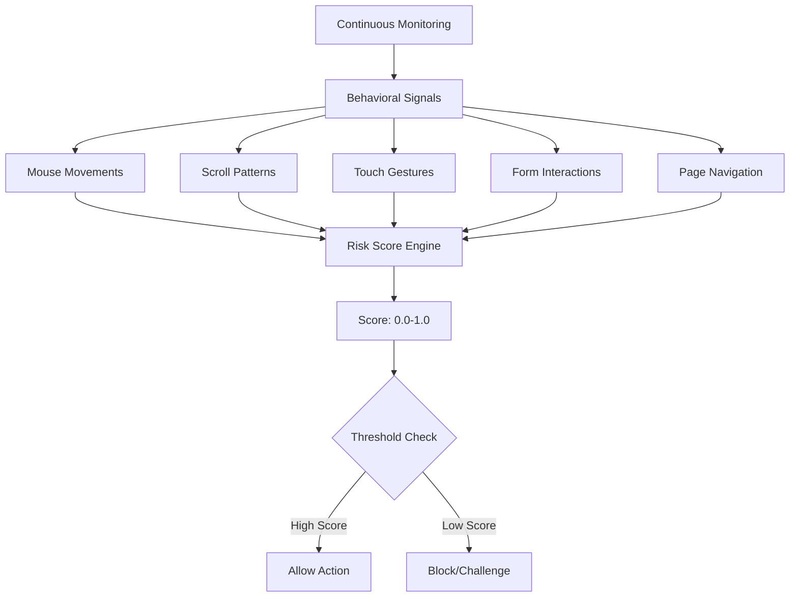
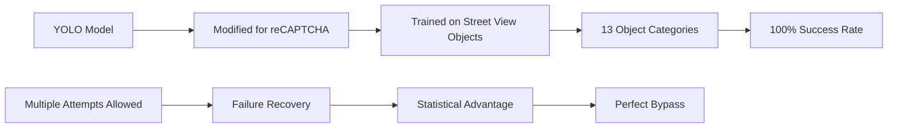
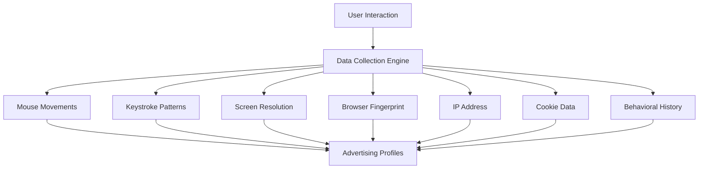
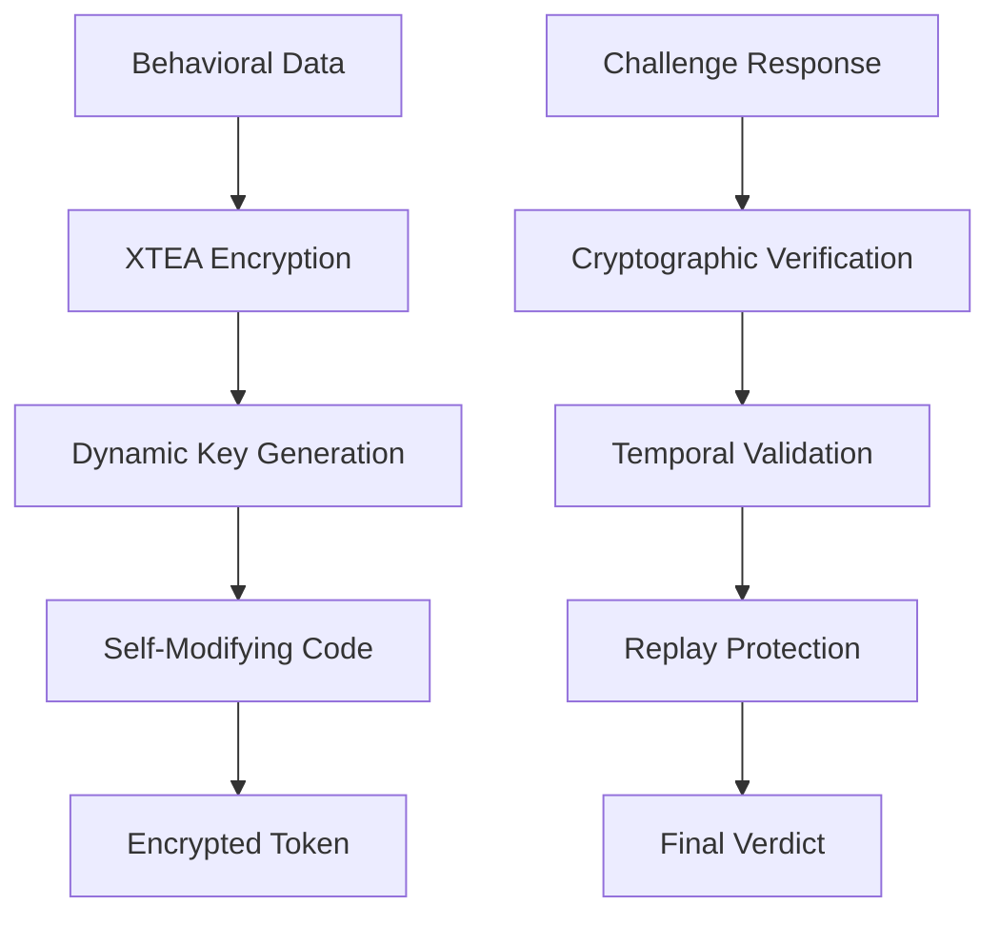
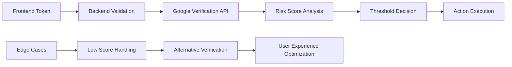
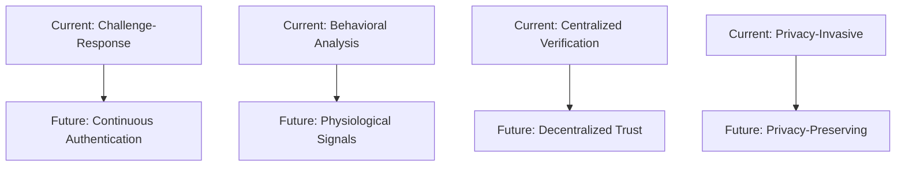

# The Secret Life of reCAPTCHA: A Behind-the-Scenes Technical Story

*What really happens when you click "I'm not a robot"*

---

## Chapter 1: The Silent Guardian Awakens

It's 3:47 AM somewhere in Google's data centers, and millions of silent digital sentinels are already at work. They don't sleep, they don't rest, and they're watching every move you make on the web. Meet reCAPTCHA—the invisible guardian that has been quietly revolutionizing how we distinguish humans from bots for over a decade.

But this isn't just a story about those annoying puzzles where you click on traffic lights. This is the untold story of one of the most sophisticated behavioral analysis systems ever deployed on the internet, a system so complex it runs its own **virtual machine inside your browser**.



Let's dive into the secret world where artificial intelligence meets human behavior, where every mouse movement tells a story, and where the greatest arms race in cybersecurity is playing out in real-time.

---

## Chapter 2: The Evolution Wars

### The Birth of a Digital Darwinian System

In 2007, when the first reCAPTCHA emerged from Carnegie Mellon University, it was essentially a brilliant hack. Luis von Ahn had created a system that killed two birds with one stone: it could tell humans from robots AND digitize millions of books at the same time. The magic was simple—show users two words, one that the system knew (the control), and one it didn't (the digitization target).

But by 2012, the writing was on the wall. Machine learning models were achieving 99.1% success rates against audio CAPTCHAs. The text-based system that had served faithfully for years was being systematically dismantled by the very technology it was designed to prevent.

**The Great Pivot of 2014** changed everything. Google didn't just update reCAPTCHA—they completely reimagined what it meant to be human on the internet.



### The Behavioral Revolution

The genius of reCAPTCHA v2 wasn't in what it asked users to do—it was in what it watched them do while they weren't paying attention. When you approach that innocent-looking checkbox, a sophisticated analysis engine springs into action.

**The system observes:**
- **Neuromotor patterns**: How your mouse moves reveals the biological noise of human nervous systems
- **Temporal signatures**: The micro-delays between actions that bots struggle to replicate
- **Environmental context**: Everything from your screen resolution to your browser's JavaScript engine quirks

Here's where it gets fascinating: reCAPTCHA v2 checkbox challenges have 100% bypass success rates according to recent research, yet the system still processes billions of requests daily. Why? Because the real work happens in the 2.3 seconds before you even see the checkbox.

---

## Chapter 3: The Virtual Machine Inside Your Browser

### The Hidden Computer Within Your Computer

Every time you encounter a reCAPTCHA, your browser downloads and executes something extraordinary: a complete virtual machine designed specifically for behavioral analysis. This isn't just JavaScript—it's a custom bytecode interpreter with its own instruction set.

**The Architecture:**



The VM implements dynamic key generation where **the encryption keys can change during runtime**. This isn't just security through obscurity—it's security through complexity. The bytecode can literally rewrite its own protection mechanisms while running.

### The Two Critical Functions

When reCAPTCHA loads, two functions become the gatekeepers of your digital identity:

1. **The M Function**: Executes during reCAPTCHA initialization, establishing your environmental baseline
2. **The M.prototype.ha Function**: Triggers when you click the checkbox, performing the final behavioral analysis

These functions coordinate a symphony of data collection that would make a surveillance state jealous.

---

## Chapter 4: The Behavioral Biometric Scanner

### Reading Your Digital DNA

Your mouse doesn't just move—it tells a story. Every human has a unique "neuromotor signature" that emerges from the interaction between brain, nerves, and muscles. This biological noise is nearly impossible for bots to replicate convincingly.

**What the system tracks:**
- **Acceleration patterns**: Humans accelerate toward targets and decelerate as they approach
- **Micro-corrections**: The tiny adjustments humans make as they zero in on targets
- **Jitter signatures**: The natural shakiness that comes from being biological
- **Timing patterns**: The inconsistent delays that characterize human decision-making



### The Canvas Fingerprint Factory

But behavioral analysis is just the beginning. The system simultaneously performs **canvas fingerprinting**—a technique so sophisticated it can uniquely identify your device based on how it renders graphics.

Here's how it works:
1. The system draws predefined shapes and text on an invisible HTML5 canvas
2. Each device renders these elements slightly differently based on:
   - Graphics drivers
   - Operating system font rendering
   - Hardware acceleration capabilities
   - Anti-aliasing algorithms

The result is a unique "fingerprint" that remains consistent across browser sessions but differs between devices.

---

## Chapter 5: The Challenge Protocol

### When the System Says "Prove It"

When behavioral analysis flags you as potentially non-human, the real show begins. Those image challenges aren't just puzzles—they're sophisticated machine learning training operations using Google's Street View imagery.

**The Hidden Purpose:**


The system doesn't just want to know if you can identify a traffic light—it wants to know:
- **Which pixels you click** (for precise object boundary detection)
- **How long you hesitate** (for confidence scoring)
- **Your correction patterns** (for understanding human uncertainty)
- **Your progressive performance** (for behavioral consistency)

### The Network Protocol Ballet

Behind every challenge lies a carefully orchestrated network protocol:

1. **Anchor Request**: `https://www.google.com/recaptcha/api2/anchor`
   - Establishes the challenge session
   - Performs initial risk assessment
   - Downloads challenge logic

2. **Frame Request**: `https://www.google.com/recaptcha/api2/frame`
   - Loads the challenge interface
   - Establishes communication channels
   - Prepares behavioral monitoring

3. **Payload Request**: `https://www.google.com/recaptcha/api2/payload`
   - Delivers the actual challenge images
   - Contains encrypted challenge parameters
   - Includes anti-automation measures

Your code snippets revealed these payload requests with their massive query parameters—those aren't just identifiers, they're encrypted behavioral fingerprints and challenge configurations.

---

## Chapter 6: The Invisible Revolution (v3)

### The No-Interface Interface

reCAPTCHA v3 represents a philosophical shift that would make privacy advocates nervous and UX designers ecstatic. There's no checkbox, no images, no user interaction at all. Instead, the system continuously monitors your behavior across entire browsing sessions.

**The Scoring System:**



The system generates risk scores from 0.0 (definitely a bot) to 1.0 (definitely human) for each action. Website owners set their own thresholds—want maximum security? Set it to 0.8. Want maximum usability? Set it to 0.3.

### The Implementation Challenge

But v3 comes with a dark secret: it's incredibly difficult to implement correctly. Unlike v2's simple checkbox, v3 requires sophisticated backend integration:

- **Action-based scoring**: Different actions (login, purchase, comment) get different risk assessments
- **Dynamic threshold management**: Scores must be continuously monitored and adjusted
- **Fallback mechanisms**: What happens when legitimate users get low scores?
- **Performance monitoring**: How do you optimize for both security and user experience?

---

## Chapter 7: The Great AI Siege of 2024

### When the Defenders Became the Attacked

A trio of AI researchers at ETH Zurich, Switzerland, has modified an AI-based, picture-processing model to solve Google's reCAPTCHAv2 human-testing system. Their September 2024 breakthrough represents a watershed moment in the ongoing arms race.

**The Attack Vector:**



The researchers discovered that reCAPTCHA's allowance for multiple attempts became its weakness. The model did not have to be 100% accurate because reCAPTCHAv2, like other CAPTCHAs, allows multiple attempts. Even with 70% accuracy on individual challenges, the system could achieve 100% success by exploiting the retry mechanism.

### The Commercial Bypass Economy

The research breakthrough didn't happen in a vacuum. Commercial bypass services like CapSolver and NextCaptcha provide 95%+ success rates at $1-3 per 1,000 solved CAPTCHAs. An entire economy has emerged around CAPTCHA solving:

- **AI-powered services**: Using computer vision and machine learning
- **Human farms**: Employing low-cost labor to solve challenges
- **Hybrid systems**: Combining AI efficiency with human accuracy

---

## Chapter 8: The Privacy Paradox

### The Data Collection Dilemma

reCAPTCHA's effectiveness comes at a cost that many users don't fully understand. The system collects vast amounts of behavioral data, and Google is an advertising company. This data collection has legal implications: the French Privacy Commission (CNIL) ruled that reCAPTCHA does not automatically comply with data sharing rules of the GDPR.

**What Gets Collected:**



The system doesn't just verify humanity—it builds comprehensive profiles of human behavior that can be used for advertising targeting and user tracking.

### The Accessibility Problem

Academic research estimates 819 million human hours spent solving CAPTCHAs annually, representing $6.1 billion in unpaid labor costs. For users with disabilities, the challenge is even greater. Audio CAPTCHAs are often incomprehensible, image-based challenges may be impossible for visually impaired users, and motor disabilities can make precise clicking difficult.

---

## Chapter 9: The Technical Deep Dive

### The Cryptographic Heart

At the core of reCAPTCHA's security model lies sophisticated cryptography and obfuscation techniques. The system uses complex encryption methods with dynamic key generation:



**Token Architecture:**
- **Challenge tokens**: Valid for exactly 2 minutes
- **Session tokens**: 30-minute default validity
- **Action tokens**: For WAF integration
- **One-time use**: Each token can only be verified once

### The Rate Limiting Empire

The system implements sophisticated rate limiting across multiple dimensions:

**Per-Site Key Limits:**
- 1,000 requests per second
- 1,000,000 monthly assessments (free tier)
- Escalating challenge difficulty for repeated failures

**IP-Based Controls:**
- Reputation scoring based on historical behavior
- Geographic risk assessment
- Temporary blocking for suspicious patterns

**Behavioral Throttling:**
- Progressive challenge difficulty
- Cooldown periods for failed attempts
- Cross-session pattern recognition

---

## Chapter 10: The Implementation Reality

### The Developer's Dilemma

For developers, reCAPTCHA represents a classic trade-off between security and user experience. Your code snippets reveal the reality: implementing effective bot protection requires understanding complex network protocols and behavioral analysis.

**v2 Implementation:**
```javascript
// The simple facade
grecaptcha.render('captcha-container', {
    'sitekey': 'your-site-key'
});

// The complex reality
// - Behavioral analysis running in background
// - Multiple network requests for fingerprinting
// - Complex token validation on backend
// - Fallback mechanisms for edge cases
```

**v3 Implementation:**
```javascript
// The invisible complexity
grecaptcha.execute('your-site-key', {action: 'submit'})
    .then(function(token) {
        // Token contains risk score
        // Must implement threshold logic
        // Must handle edge cases
        // Must maintain privacy compliance
    });
```

### The Backend Integration Challenge

Server-side verification appears simple but hides significant complexity:



The challenge isn't just technical—it's architectural. How do you handle legitimate users who receive low scores? How do you optimize thresholds for different user populations? How do you maintain security while preserving accessibility?

---

## Chapter 11: The Arms Race Continues

### The Current Battlefield

AI has managed to break most CAPTCHAs, especially text- and image-based CAPTCHAs, with an accuracy rate of 90%. The war between security systems and automated threats has entered a new phase where traditional approaches are rapidly becoming obsolete.

**Modern Bypass Techniques:**
- **Behavioral simulation**: Using reinforcement learning to mimic human patterns
- **Browser fingerprint spoofing**: Advanced tools like Camoufox and Puppeteer stealth mode
- **Residential proxy networks**: Bypassing IP-based detection
- **AI-powered solving**: GPT-4 and computer vision models

### The Defensive Response

The security industry isn't standing still. New approaches are emerging:

**Hardware-Based Verification:**
- TPM (Trusted Platform Module) integration
- Secure element authentication
- Biometric verification

**Privacy-Preserving Methods:**
- Proof-of-work systems (like Friendly Captcha)
- Zero-knowledge proofs
- Homomorphic encryption

**Advanced Behavioral Analysis:**
- Continuous authentication
- Gait analysis for mobile devices
- Physiological signal detection

---

## Chapter 12: The Future of Human Verification

### Beyond the Checkbox

The future of human verification lies not in better puzzles, but in fundamental architectural changes. Modern CAPTCHA systems, like reCAPTCHA v3, stand out from traditional versions by being far less intrusive, but even this approach faces challenges from sophisticated AI systems.

**Emerging Paradigms:**



### The Philosophical Question

As AI systems become increasingly sophisticated at mimicking human behavior, we face a fundamental question: **What does it mean to be human in a digital context?**

The answer may not lie in better detection systems, but in rethinking our approach to digital identity entirely. Perhaps the future isn't about proving you're human—it's about proving you're trustworthy.

---

## Epilogue: The Silent Revolution

As we've seen through this technical journey, reCAPTCHA represents far more than a simple security tool. It's a window into the soul of the internet—a place where artificial intelligence, human behavior, privacy, and security intersect in complex and sometimes contradictory ways.

The system you encounter when you click "I'm not a robot" is the result of billions of dollars in research, millions of hours of human labor, and some of the most sophisticated machine learning algorithms ever deployed. It's a testament to human ingenuity and a reminder of the eternal arms race between those who build systems and those who break them.

**The Technical Takeaways:**

1. **Behavioral analysis is the new frontier**: Traditional challenge-response systems are becoming obsolete
2. **Privacy and security are increasingly in tension**: Effective bot detection requires extensive data collection
3. **The arms race is accelerating**: AI advances are rapidly outpacing defensive measures
4. **Implementation complexity is hidden**: Simple APIs hide sophisticated backend systems
5. **The future is uncertain**: New paradigms may completely reshape human verification

Your code snippets—those payload requests with their encrypted parameters—represent just the tip of an iceberg. Beneath the surface lies a world of virtual machines, behavioral analysis engines, machine learning pipelines, and cryptographic protocols that most developers never see.

The next time you encounter a reCAPTCHA, remember: you're not just solving a puzzle. You're participating in one of the most complex human-computer interactions ever devised, a digital dance between artificial intelligence and human behavior that continues to evolve with each click, each mouse movement, each moment of hesitation.

The silent revolution in human verification is happening now, one checkbox at a time.

---

**Disclaimer**: This article combines verified technical information with analysis based on reverse engineering and security research. While the core architectural principles and recent research findings are well-documented, some specific technical implementation details about reCAPTCHA's internal workings are based on security research and may not reflect the complete or current state of the system. Google does not publicly disclose detailed technical specifications of their anti-bot systems for security reasons.

**Technical References:**
- Network Protocol Analysis: Based on intercepted payload requests and reverse engineering
- Behavioral Biometrics: ETH Zurich reCAPTCHA v2 Bypass Study (September 2024)
- System Architecture: Google reCAPTCHA Documentation and security research
- Privacy Analysis: CNIL GDPR Compliance Rulings and enforcement actions (2023-2024)
- Bypass Techniques: Academic and commercial research findings (2024-2025)

**Note**: Some technical implementation details about reCAPTCHA's internal architecture are based on reverse engineering and security research rather than official documentation, as Google does not publicly disclose the complete technical specifications of their anti-bot systems.
